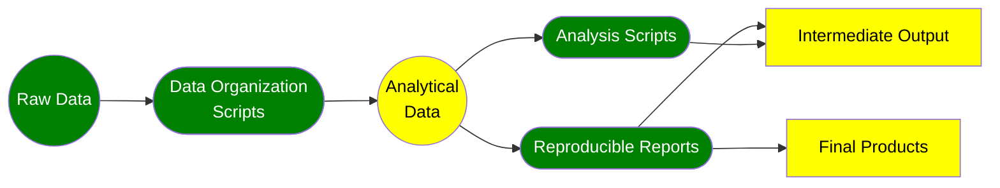

## A Reproducible Research Workflow

<dl>
  <dt>Raw Data</dt>
  <dd>The external data to be analyzed. To ensure reproducibility, these files should never be edited and they should be placed in a dedicated subdirectory for raw data sources.</dd>
  <dt>Data Organization Scripts</dt>
  <dd>Script or scripts that transform/wrangle the original raw data into the analytical data that will actually be analyzed. This process may include recoding, subsetting, imputing missing values, merging, reshaping, etc.</dd>
  <dt>Analytical Data</dt>
  <dd>The product of the data organization scripts. These files will typically be stored in binary format and should be placed in a different location than raw data to avoid confusion.</dd>
  <dt>Analysis Scripts</dt>
  <dd>The scripts that load in the analytical data and perform the analysis which may involve creating tables and figures, summarizing, aggregating, and the creation of models, among other things.</dd>
  <dt>Reproducible Reports</dt>
  <dd>Reports that will generate final products such as research manuscripts, reports, presentations, and posters. These run integrated code to produce consistent results programmatically (e.g. Quarto, R Markdown, or Sweave documents).</dd>
  <dt>Intermediate Output</dt>
  <dd>Output created in the process of analysis. This could include log files, figure images, text output of model results, etc.</dd>
  <dt>Final Products</dt>
  <dd>Final polished products for external audience produced by the reproducible reports. This could include research manuscripts, reports, presentations, or posters.</dd>
</dl>

### What is real about your workflow?

- Everything in green is what is real about your workflow. This includes all of the scripts, reproducible reports, and the raw data.
- Everything in yellow is an artifact produced at a certain point in time by the things that are real (i.e. your scripts and your raw data). 

If your workflow is reproducible then you should be able to delete all of the items in yellow at any time and exactly reproduce them via what is real.