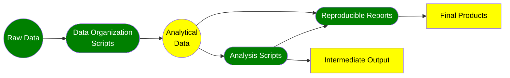

This repository is a template repository for a research project using a [Quarto Project](https://quarto.org/docs/projects/quarto-projects.html) and a [Reproducible Research Workflow](#a-reproducible-research-workflow) geared for open science. This template serves as a good project base for anyone using R as their primary language for conducting research, but could be retooled for other languages supported by [Quarto](https://quarto.org), like Python and Julia.

## Quickstart

To start an actual research project with this template:

1. Click the green "Use this template" button above to create a new GitHub repository based on this template.
2. From GitHub, change the README file contents to describe your project.
3. Clone the generated repository to your own local machine. I usually do this via RStudio from File > New Project (or the Gelatinous Cube button), and then choose "From Version Control."
4. Change the name of the `research-template.Rproj` file in the local repository to the name of your project.
5. Open the project in RStudio. I usually do this by double-clicking the Rproj file.
6. From RStudio, open the `_quarto.yml` file and change the project title and author information. You can add multiple authors here if you like.
7. Go to `utils/check_packages.R` and add or remove any packages based on what your project requires. Source this file in to make sure you have all the dependencies installed.
8. In the upper right panel of RStudio, go to the Build tab and click "Render project." You will see how quarto runs through the entire project, script by script. Look at the `_products` directory for the output.
9. Dump some raw data into into `data/data_raw` and start coding!

You may also want to update the extensions that are included with the project when you start it. To do this type into the Terminal:

```bash
quarto update AaronGullickson/aog-article-quarto
quarto update AaronGullickson/submittable-quarto
```

## A Reproducible Research Workflow

### Three Phases

This workflow assumes that a research project can generally be divided into three distinct phases. These phases are:

<dl>
  <dt>Generating Analytical Data</dt>
  <dd>In this phase, raw data sources are converted into an analytical dataset or datasets that provide the necessary variables and data cleaning for researchers to conduct the research. This step is often called "data cleaning" but can involve many different activities such as recoding variables, imputing missing values, subsetting data, aggregating data, merging two or more data sources, and reshaping data. Regardless of the specific activity, researchers should always **check themselves before they wreck themselves** to ensure none of these procedures create errors. 
 Although sometimes characterized as the "drudgery" phase of analysis, this phase is absolutely critical to a successful data analysis. Moreover, the decisions made at this stage often reflect important conceptual and theoretical issues related to the broader research questions and thus it should not be seen as simple preparatory work for the actual analysis, but in fact, a key part of the overall project itself.</dd>
    <dt>Performing the Analysis</dt>
    <dd>In this phase, the researchers use the constructed analytical data to perform the main analysis. This may include, among other things, exploratory work using data visualizations, the creation of simple statistical summaries, the creation of complex models. In doing this analysis, the researchers may create many data artifacts such as log files, model output, lab notebooks, etc. As I explain below, these artifacts are never the product of the work, and are instead potential sources of danger because some artifacts may not be up to date with the most iteration of a project.</dd>
    <dt>Creating Final Products</dt>
    <dd>The final products of a research project might be a manuscript for journal submission, a research report, a presentation, a poster, etc. In this phase, the output of the previous phase is typically converted into a more public facing document. Traditionally, errors in transcription are a real concern in this phase as researchers translate things like model output to tables in the final products. Additionally, versioning errors can be an issue here because some of the research artifacts from the previous phase may not reflect the most recent iteration of the analytical data.</dd>
</dl>

Importantly, this workflow should be **iterative** as earlier phases are revisited based on extensions or expansions in the project. For example, the researchers may only initially use a few variables and/or observations from the raw data to quickly get a skeleton analysis together with the key variables and models. From this point, they may then go back to the first phase to add in additional variables, observations, deal with missing values, etc. Good programming practices in setting up the structure of the workflow will make this iterative procsess easier later in the project.

### The Principles of a Reproducible Research Workflow

In a reproducible research workflow, we use scripting and reproducible reports to reduce the potential for versioning and transcription errors at each phase of the workflow. This workflow is visualized in the flowchart below.



<dl>
  <dt>Raw Data</dt>
  <dd>The external data to be analyzed. To ensure reproducibility, these files should never be edited and they should be placed in a dedicated subdirectory used only for raw data sources.</dd>
  <dt>Data Organization Scripts</dt>
  <dd>Script or scripts that transform/wrangle the original raw data into the analytical data that will actually be analyzed. This process may include recoding, subsetting, imputing missing values, merging, reshaping, etc.</dd>
  <dt>Analytical Data</dt>
  <dd>The product of the data organization scripts. These files will typically be stored in binary format and should be placed in a different location than raw data to avoid confusion. The analytical data is an *artifact* and thus a potential source of error.</dd>
  <dt>Analysis Scripts</dt>
  <dd>The scripts that load in the analytical data and perform the analysis which may involve creating tables and figures, summarizing, aggregating, and the creation of models, among other things.</dd>
  <dt>Reproducible Reports</dt>
  <dd>Reports that will generate final products such as research manuscripts, reports, presentations, and posters. These files run integrated code to produce consistent results programmatically (e.g. Quarto, R Markdown, or Sweave documents).</dd>
  <dt>Intermediate Output</dt>
  <dd>Output created in the process of analysis. This could include log files, figure images, text output of model results, etc. All of these files are *artifacts* and thus a potential source of error.</dd>
  <dt>Final Products</dt>
  <dd>Final polished products for external audience produced by the reproducible reports. This could include research manuscripts, reports, presentations, or posters.</dd>
</dl>

Everything shown above in green is the *real* part of your workflow. This includes the raw data, the scripts, and the reproducible reports. The remaining *yellow* parts are artifacts and should be reproducible at any point fom the real part of your workflow. You should feel comfortable deleting the yellow parts at any point because they can be reproduced by the green parts. In fact, you should make it a regular practice to delete all the yellow parts and rerun your analysis from the start on a regular basis to ensure artifacts are not affecting your results.

## Using This Workflow

This workflow follows the general principles outlined above. Generally the research process will proceed as follows:

1. Add raw data sources to `data/data_raw`. When I am using multiple data sources, I often place these in sub-directories. I also usually document each data source in the README within the `data_raw` directory. Only raw data should be kept in this directory.
2. Use the `analysis/organize_data.qmd` file to construct analytical data from the raw data. I prefer to do this in a quarto document rather than a plain R script because then I get essentially a research log (HTML format) in which I can keep track of all my tests to ensure that my data cleaning worked as intended. Typically, you will save the final analytical data into an `RData` file. This file (or files) should always be placed in `data/data_constructed`
3. Use the `analysis/analysis.qmd` to conduct the analysis. This will produce a lab notebook in HTML format. Sometimes, when it takes a long time to run models or other things, I may save some of the output as RData files and place it in the same `data/data_constructed` folder.
4. Use the quarto documents in the `paper` directory and/or the `presentation` directory to create papers and presentations, respectively. I will often pull code chunks from the `analysis.qmd` to these files as a starting point for final tables and figures. By default, I use my own [custom template](https://github.com/AaronGullickson/aog-article-template) to produce manuscript PDF files, but you can switch this to another template of your choice. The `bibliography` directory contains a Bibtex file for the project that can be exported from other software or built from within the quarto documents themselves. You can also place your preferred [CSL files](https://www.zotero.org/styles) here.

The output of all rendered quarto documents will be placed in the `_products` directory. This directory along with `data/data_constructed` contain the artifacts from the workflow.

In everyday practice, individual files will be rendered separately, but the entire project can also be rendered. The user should periodically do this because it will automatically delete any prior artifacts and start from scratch, ensuring that all rendered output is up to date with the most current iteration of the scripts. The project can be rendered from the `Build` tab in the upper right panel of RStudio, or from the command line of the base project directory:

```bash
quarto render
```

### Adding Author Information

All quarto files will pull author information from the main `_quarto.yml` file. The author information there should be changed to reflect the authors of the project. Multiple authors can be listed.

### Adding Additional Scripts

For big projects a single `organize_data.qmd` and `analysis.qmd` file may not be sufficient. You can split each of those files into multiple files of the same type. If you do, you will need to update the `_quarto.yml` file to specify these files and the order in which they should be run in the `render` section. For example if you split `organize_data.qmd` into `organize_data_source1.qmd` and `organize_data_source2.qmd`, you would change that section to read:

```yaml
 render:
    # if analysis is split into multiple docs, add them here
    - analysis/organize_data_source1.qmd
    - analysis/organize_data_source2.qmd
    - analysis/analysis.qmd
    - paper/
    - presentation/
    - "!bibliography/"
```

To ensure package dependencies are properly specified and that global functions are loaded, any new R scripts or Quarto document created should always start with:

```r
library(here)
source(here("utils","check_packages.R"))
source(here("utils","functions.R"))
```

### Handling Package Dependencies

Aside from the `here` library, no direct library commands should be written into R scripts or quarto documents. Instead, all of these scripts should source in the `utils/check_packages.R` script which will check for package dependencies and install needed packages. Users can add or remove packages from the list specified in that file. Anyone using the project can source this file to both load the dependencies and ensure they are up-to-date.

### Making Global Functions

To create custom functions that will be accessible to all scripts in the project, users should create such functions in the `utils/functions.R` script. This script is then sourced into all other scripts.